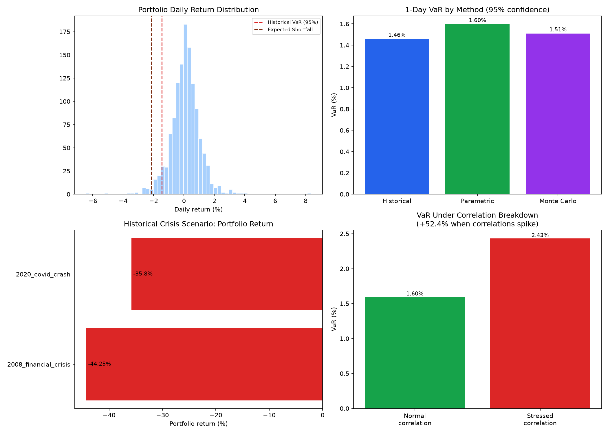

# Portfolio Risk Modeling: VaR & Stress Testing

Value-at-Risk (VaR) computed three ways, plus historical crisis stress
testing, on a diversified 5-stock portfolio. Part of a broader quant
portfolio (alongside options pricing models and a backtested trading
strategy).

## Portfolio

A cross-sector portfolio deliberately chosen to be diversified rather than
concentrated in one industry:

| Ticker | Sector | Weight |
|---|---|---|
| AAPL | Technology | 25% |
| JPM | Financials | 25% |
| XOM | Energy | 20% |
| JNJ | Healthcare | 15% |
| WMT | Consumer Staples | 15% |

## What's in here

### Value-at-Risk, three ways

- **Historical simulation**: uses actual historical portfolio returns
  directly -- no distributional assumption, but entirely dependent on the
  historical window used.
- **Parametric (variance-covariance)**: assumes normally distributed
  returns, computes VaR analytically from the covariance matrix. Fast, but
  underestimates risk when real returns have fat tails (which they almost
  always do).
- **Monte Carlo**: simulates many possible outcomes from the estimated
  mean/covariance, then reads VaR off the simulated distribution.

Also included: **Expected Shortfall** (Conditional VaR) -- the average
loss in the worst-case tail, addressing VaR's key blind spot: it says
nothing about how bad losses get once they exceed the VaR threshold.

### Stress testing

- **Historical crisis scenarios**: applies real 2008 financial crisis and
  2020 COVID crash shocks to the current portfolio weights, broken down by
  which holdings drove the loss.
- **Correlation breakdown**: recomputes VaR assuming all pairwise
  correlations spike toward 1 (as they typically do in a real crisis),
  holding individual asset volatilities fixed. This isolates and quantifies
  a specific, important risk: diversification benefits shrink exactly when
  they're needed most.

## Results

```bash
python run_analysis.py --tickers AAPL JPM XOM JNJ WMT --weights 0.25 0.25 0.2 0.15 0.15 --years 5
python notebooks/plot_risk_analysis.py
```



*(Replace this chart and the numbers below with your own real output.)*

| Metric | Value |
|---|---|
| Historical VaR (95%, 1-day) | placeholder |
| Parametric VaR (95%, 1-day) | placeholder |
| Monte Carlo VaR (95%, 1-day) | placeholder |
| Expected Shortfall (95%) | placeholder |
| 2008 crisis scenario P&L | placeholder |
| 2020 COVID scenario P&L | placeholder |
| VaR increase under correlation breakdown | placeholder |

**Interpretation:** [fill in after running on real data -- e.g. do the
three VaR methods agree or diverge? Real equity returns typically have
fatter tails than the normal distribution assumes, so historical and Monte
Carlo VaR often exceed parametric VaR in practice. Which crisis scenario
hurts the portfolio more, and why, given the sector weights?]

## Why three VaR methods, not just one

No single VaR method is strictly better -- each makes a different trade-off:

- Historical simulation captures real fat tails and skew, but is a pure
  reflection of whatever happened to be in the historical sample. A calm
  five-year window will understate risk; a five-year window including a
  crash will overstate typical-day risk.
- Parametric VaR is fast and interpretable, but assumes normality --
  a real weakness, since financial returns are well known to have fatter
  tails than a normal distribution.
- Monte Carlo is flexible (can be extended to non-normal distributions or
  more complex dependency structures) but is only as good as the assumed
  return-generating process, and is the most computationally expensive.

Comparing all three -- and reporting Expected Shortfall alongside VaR -- is
standard risk management practice precisely because relying on one method
alone can create a false sense of precision.

## Running it

```bash
pip install -r requirements.txt

# Run the full analysis on real data (requires internet access)
python run_analysis.py --tickers AAPL JPM XOM JNJ WMT --weights 0.25 0.25 0.2 0.15 0.15 --years 5

# Generate the visualization from the saved results
python notebooks/plot_risk_analysis.py

# Run tests
python tests/test_var_models.py
python tests/test_stress_testing.py
```

Useful flags on `run_analysis.py`:
- `--tickers` / `--weights`: define your own portfolio (weights must sum to 1)
- `--years`: how many years of historical data to use
- `--portfolio-value`: dollar size of the portfolio for $ P&L figures
- `--confidence`: VaR confidence level (default 0.95)

## Validation

All 8 VaR model tests pass (`tests/test_var_models.py`), including checks
that:
- Expected Shortfall is always >= VaR (true by definition)
- VaR scales with the square root of time, as standard risk management
  practice assumes
- All three VaR methods converge closely when the underlying data really
  is normally distributed
- 99% VaR is always more extreme than 95% VaR

All 7 stress testing tests pass (`tests/test_stress_testing.py`), including
a check that VaR under a correlation breakdown is always greater than or
equal to normal-times VaR, and that perfect correlation (1.0) reduces
portfolio risk to the simple weighted sum of individual asset volatilities
-- i.e. zero diversification benefit, as theory predicts.

## Project structure

```
risk-modeling/
├── risk/
│   ├── var_models.py       # Historical, parametric, and Monte Carlo VaR + Expected Shortfall
│   └── stress_testing.py   # Historical crisis scenarios + correlation breakdown
├── tests/
│   ├── test_var_models.py
│   └── test_stress_testing.py
├── notebooks/
│   ├── plot_risk_analysis.py
│   └── risk_analysis.png   # Generated chart
├── data/                   # Saved returns data and analysis summary (CSV/JSON)
├── run_analysis.py         # Main entry point: fetch data + run full analysis
├── requirements.txt
└── README.md
```

## Possible extensions

- Backtest VaR itself: check how often actual losses exceeded the VaR
  estimate historically (should be close to the stated confidence level --
  this is called VaR "backtesting" or a Kupiec test)
- Add more crisis scenarios (2022 rate-hike selloff, 2011 European debt
  crisis)
- Extend Expected Shortfall to the parametric and Monte Carlo methods, not
  just historical
